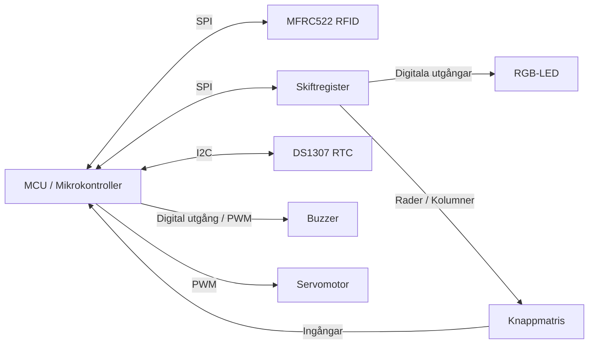

# Arduino Uno Bas-skelett för inlämningsuppgiften delmoment 2

I denna del närmar vi oss den ösnkade slutprodukten. Vi har fått ett halvdant repo från förra konsulten som fått sparken för att den var för lat. Vi hoppas du kan visa att du är bättre och komplettera och förbättra där det behövs. 

Det vi vill kunna visa upp är:
1. En fungerande keypad
2. Möjlighet att hämta tiden från RTC
3. Aktivera lysdioder och buzzer
4. Möjlighet att läsa av RFID
5. Aktivering av servo

I repot finns det ett flertal drivrutiner som är korrekt implementerade, till viss del korrekt implementerade och inte implementerade alls. Ert uppdrag bli att se till att allt fungerar som det ska inför nästa steg.

## Det ni behöver göra är:

### Shift register
Implementera en drivrutin för shift register (74hc595)

Tänkbara funktioner
- shift_register_init()
- shift_register_set_bit()
- shift_register_clear_bit()

### Modifera keypad
Använd interface för shift register ovan för att möjliggöra key scan fungerar

Se tidigare version, ska inte behövas ändras mer än några rader!

### Implementera LED driver
Använd interface för shift register ovan för att möjliggöra användnignen av RGB-lysdioden

- led_init()
- green_led_on()
- green_led_off()
- red_led_on()
- red_led_off()
- blue_led_on()
- blue_led_off()

### Implementera SERVO driver
Implementera en driver för servon 

Tänkbara funktioner:
- servo_init()
- servo_open()
- servo_close()

### Kontrollera att MFRC522RFID
Kontrollera att mfrc522rfid fungerar som den ska, undersök api

### Implementera DS1307 Drivrutin
Implementera en drivrutin till DS1307 RTC så vi enkelt kan få tiden

### Implementera BUZZER drivrutin 
Implementera en buzzer driver 

Tänkbara funktioner:
- buzzer_init()
- buzzer_scream()
- buzzer_quiet()

### Varning
Förbehåller mig rätten för olycklig felkopplingar och andra knasigheter! Eventuella krockar med pins och timers och annat dylikt.

//Sebbson

PS: Vi kommer stega igenom alla delarna tillsammans framöver!


## Överblick

```
---
                         ┌─────────────────┐
                         │   DS1307 RTC    │
                         │      I2C        │
                         └────────┬────────┘
                                  │
                                  │ SDA / SCL
                                  │
┌─────────────────┐        ┌──────▼───────┐        ┌─────────────────┐
│ MFRC522 RFID    │◄──────►│              │◄──────►│ Skiftregister   │
│ SPI             │  SPI   │     MCU      │  SPI   │ SPI             │
└─────────────────┘        │              │        └──────┬──────────┘
                           └───┬────┬─────┘               │
                               │    │                     │
                               │    │                     ▼
                               │    │              ┌──────────────┐
                               │    │              │   RGB-LED    │
                               │    │              └──────────────┘
                               │    │
                PWM / digital  │    │ PWM
                               │    │
                         ┌─────▼─┐  ┌▼────────────┐
                         │Buzzer │  │ Servomotor  │
                         └───────┘  └─────────────┘


                  ┌─────────────────────┐
                  │     Knappmatris     │
                  └───────┬────────┬────┘
                          │        │
                          │        └──────────► MCU-ingångar
                          │
                          └──────────────────► Skiftregister
```